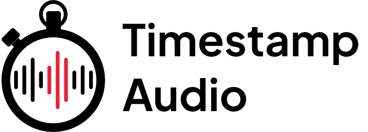

# TimestampAudio.com - Front End



The [TimeStampAudio.com](https://timestampaudio.com) web app generates timing data from
any audio and corresponding text file, in the over [1,100
languages](https://dl.fbaipublicfiles.com/mms/misc/language_coverage_mms.html) supported
by [Meta's MMS ASR
model](https://ai.meta.com/blog/multilingual-model-speech-recognition/), outputting the
results in JSON and SRT.

## Built With

- **Next.js** Server-side rendering and static site generation
- **React** Component-based UI
- **TailwindCSS** Utility-first CSS framework
- **Vercel**: Deployment

## Installation

To get started with the frontend, clone the repository and install dependencies:

```bash
git clone https://github.com/kingdomstrategies/waha-ai-timestamper.git
cd waha-ai-timestamper
yarn
```

## Usage

After installation, you can run the development server:

```bash
yarn dev
```

The app will be available at http://localhost:3000.

## Contributing

If you’d like to contribute, please fork the repository and use a feature branch. Pull requests are warmly welcome.

## License

This project is licensed under the GNU License.